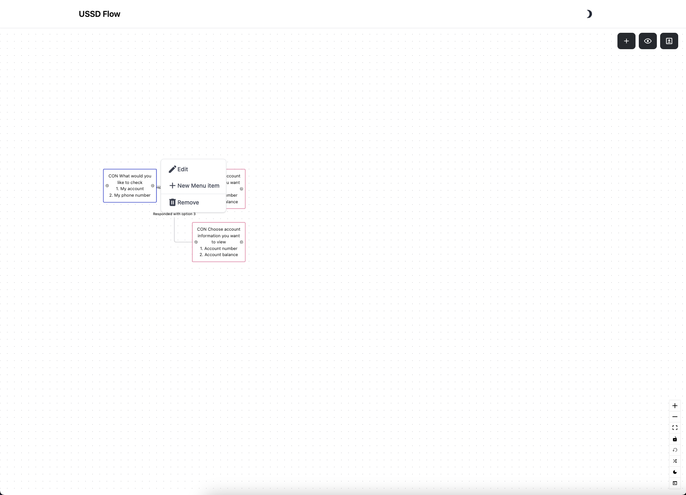

Sure, here’s the generalized guide for creating a menu flow using the provided UI, including the screenshots.

### Generalized Guide for Creating Menu Flow

#### Step 1: Open the USSD Flow Builder

1. **Access the Interface**: Open the USSD Flow Builder interface where you will create and manage your menu flows.

#### Step 2: Create a New Menu Item

1. **Add Menu Item**: Click the `+` button in the top right corner to add a new menu item.
   

#### Step 3: Configure the Menu Item

1. **Set Menu Level**: Enter the menu level (e.g., `1`, `2`, `3`, etc.).
2. **Enter Menu Text**: Provide the text to be displayed for the menu.
   ```plaintext
   CON What would you like to check
   1. Option 1
   2. Option 2
   ```



#### Step 4: Add Menu Options

1. **Add Option**: Click the `+ New Menu Item` button to add a menu option.
2. **Configure Option**:
   - **Option Type**: Select `level` if it leads to another menu level or `response` if it ends the session.
   - **Response**: Enter the response text if the option type is `response`.
   - **Next Menu Level**: Select the next menu level if the option type is `level`.
   - **Action**: Specify any action to be performed (if applicable).

Repeat the above steps to add all necessary options.


#### Step 5: Set Additional Menu Properties

1. **Max Selections**: Set the maximum number of selections allowed for the menu.

#### Step 6: Save the Menu Item

1. **Save**: Click the `Save Item` button to save the menu configuration.

#### Step 7: Edit Existing Menu Items (if needed)

1. **Select Menu Item**: Click on an existing menu item in the interface to edit.
2. **Edit Details**: Modify the menu level, text, options, and properties as needed.
3. **Save Changes**: Click the `Save Item` button to save the changes.


### Example Configuration

Here is a simple example of how you might set up a basic menu flow:

1. **Main Menu** (Level 1):

   - **Text**:
     ```plaintext
     CON What would you like to check
     1. My account
     2. My phone number
     ```
   - **Options**:
     - **Option 1**:
       - **Type**: `level`
       - **Next Menu Level**: `2`
     - **Option 2**:
       - **Type**: `response`
       - **Response**: `END Your Phone Number is ${phone_number}`
       - **Action**: `process_account_phone_number`
   - **Max Selections**: `2`

2. **Account Menu** (Level 2):
   - **Text**:
     ```plaintext
     CON Choose account information you want to view
     1. Account number
     2. Account balance
     ```
   - **Options**:
     - **Option 1**:
       - **Type**: `response`
       - **Response**: `END Your account number is ${account_number}`
       - **Action**: `process_account_number`
     - **Option 2**:
       - **Type**: `response`
       - **Response**: `END Your Account balance is ${account_balance}`
       - **Action**: `process_account_balance`
   - **Max Selections**: `2`
